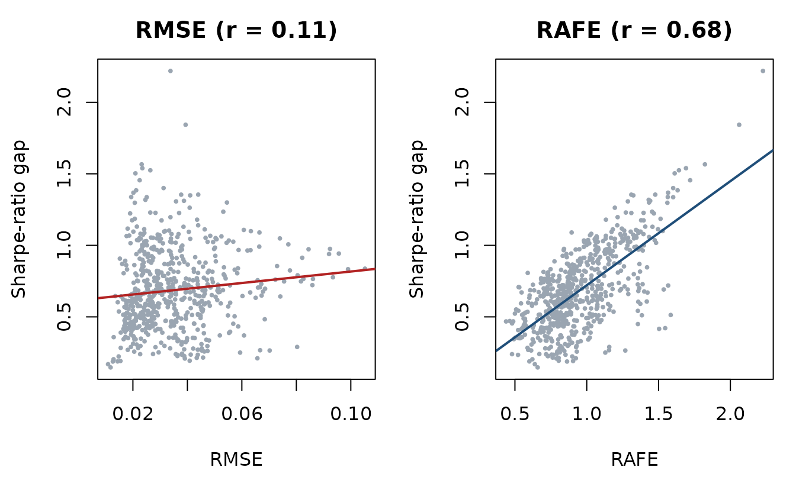
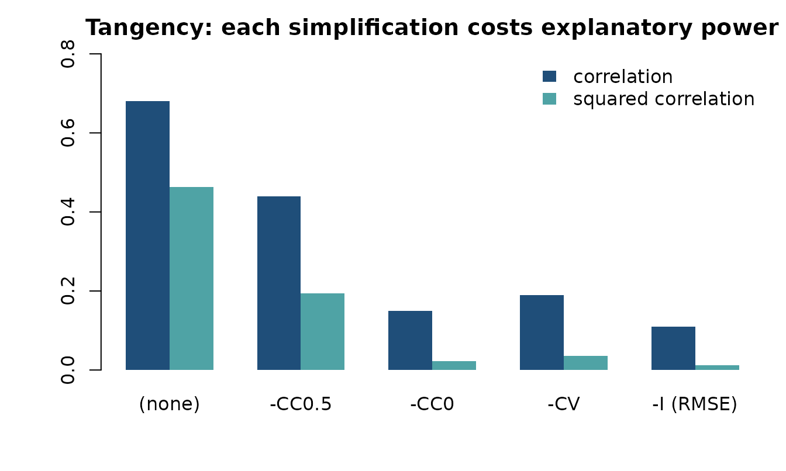
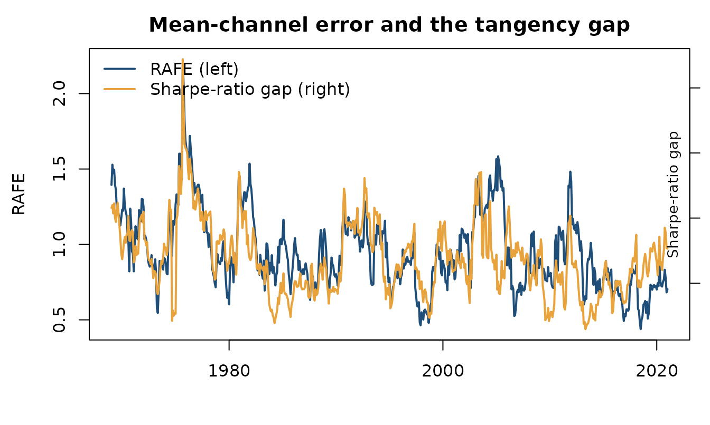

# 1. Evaluating forecasts: reproducing the published results

``` r

library(rafe)
data(ff12)
```

This vignette reproduces the empirical results of Salcher, Stöckl &
Hanke (2026, *Journal of Forecasting*), Section 6, using only functions
from this package, and checks them against the published tables.

## The claim being tested

A forecast is scored with root mean squared error. A portfolio is scored
by its Sharpe ratio. If the first were a good proxy for the second,
forecasts with lower RMSE would produce portfolios closer to the best
attainable Sharpe ratio.

The paper’s argument is that RMSE is what remains after almost all the
risk information has been stripped out of a sound error measure.
Starting from RAFE and imposing progressively cruder assumptions on the
covariance gives a nested sequence ending at RMSE:

| Restriction | Covariance used to weight the error                           |
|-------------|---------------------------------------------------------------|
| `"none"`    | the realised covariance $`\Sigma`$ — full RAFE                |
| `"cc05"`    | variances kept, all correlations set to $`\rho = 0.5`$        |
| `"cc0"`     | variances kept, all correlations set to $`0`$                 |
| `"cv"`      | correlations $`0`$, all variances set to the average variance |
| `"i"`       | the identity — this *is* RMSE                                 |

[`restrict_cov()`](https://www.sebastianstoeckl.com/rafe/reference/restrict_cov.md)
performs the restriction; every metric takes a `variant`:

``` r

S <- stats::cov(as.matrix(ff12[1:120, 2:6]))
round(stats::cov2cor(restrict_cov(S, "cc05")), 2)
#>      [,1] [,2] [,3] [,4] [,5]
#> [1,]  1.0  0.5  0.5  0.5  0.5
#> [2,]  0.5  1.0  0.5  0.5  0.5
#> [3,]  0.5  0.5  1.0  0.5  0.5
#> [4,]  0.5  0.5  0.5  1.0  0.5
#> [5,]  0.5  0.5  0.5  0.5  1.0
```

## The design

Monthly excess returns on the 12 Fama-French industry portfolios,
January 1964 to December 2023. Rolling 60-month estimation windows and
the following 36-month evaluation windows, stepping one month. Training
moments are the forecast; realised moments of the test window are the
truth.

``` r

R <- as.matrix(ff12[, -1])
train_len <- 60L; test_len <- 36L
dates <- ff12$date
c(months = nrow(R), assets = ncol(R),
  windows = nrow(R) - train_len - test_len + 1L)
#>  months  assets windows 
#>     720      12     625
```

Weights use a ridge-shrunk covariance inverse; the tangency portfolio is
normalised to full investment.

``` r

ridge_inverse <- function(Rw, alpha = 0.20) {
  S  <- stats::cov(Rw)
  Ss <- (1 - alpha) * S + alpha * diag(diag(S))
  ev <- eigen(Ss, symmetric = TRUE, only.values = TRUE)$values
  if (min(ev) < 1e-6) Ss <- Ss + diag(abs(min(ev)) + 1e-4, ncol(Ss))
  solve(Ss)
}
budget   <- function(w) w / sum(w)
sharpe   <- function(w, R_test) { r <- drop(R_test %*% w); mean(r) / stats::sd(r) }
```

## The rolling evaluation

Two strategies: the **tangency** portfolio, which needs both moments,
and the **global minimum-variance** portfolio, which needs only the
covariance. Keep that difference in mind — it becomes the point later.

``` r

variants <- c("none", "cc05", "cc0", "cv", "i")
starts   <- seq_len(nrow(R) - train_len - test_len + 1L)
ones     <- rep(1, ncol(R))

panel <- do.call(rbind, lapply(starts, function(s) {
  tr <- R[s:(s + train_len - 1L), ]
  te <- R[(s + train_len):(s + train_len + test_len - 1L), ]

  mu_hat <- colMeans(tr)
  Sigma_hat <- stats::cov(tr)
  Sigma_w_inv <- ridge_inverse(tr)

  mu <- colMeans(te); Sigma <- stats::cov(te); Sigma_inv <- solve(Sigma)

  sr_tan <- sharpe(budget(drop(Sigma_w_inv %*% mu_hat)), te)
  sr_gmv <- sharpe(budget(drop(Sigma_w_inv %*% ones)), te)
  or_tan <- sqrt(drop(t(mu) %*% Sigma_inv %*% mu))       # perfect foresight
  or_gmv <- sharpe(budget(drop(Sigma_inv %*% ones)), te)

  c(vapply(variants, function(v) compute_rafe(mu_hat, mu, Sigma, variant = v),
           numeric(1)),
    setNames(vapply(variants, function(v) as.numeric(
      compute_trafe(mu_hat, mu, Sigma, Sigma_hat, variant = v, SR_star = or_tan)),
      numeric(1)), paste0("T_", variants)),
    setNames(vapply(variants, function(v) as.numeric(
      compute_trafe(mu_hat, mu, Sigma, Sigma_hat, variant = v, SR_star = or_gmv)),
      numeric(1)), paste0("G_", variants)),
    crafe = compute_crafe(Sigma, Sigma_hat),
    sr_tan = sr_tan, sr_gmv = sr_gmv, or_tan = or_tan, or_gmv = or_gmv,
    gap_tan = or_tan - sr_tan, gap_gmv = or_gmv - sr_gmv)
}))
panel <- as.data.frame(panel)
panel$date <- dates[starts + train_len]
nrow(panel)
#> [1] 625
```

## What the portfolios actually earned

Before any metric, the raw economics. Monthly Sharpe ratios, averaged
over the 625 evaluation windows:

``` r

data.frame(
  strategy      = c("Tangency", "Global minimum variance"),
  realised      = c(mean(panel$sr_tan), mean(panel$sr_gmv)),
  perfect_foresight = c(mean(panel$or_tan), mean(panel$or_gmv)),
  gap           = c(mean(panel$gap_tan), mean(panel$gap_gmv))
)
#>                  strategy realised perfect_foresight    gap
#> 1                Tangency  0.07074            0.7563 0.6856
#> 2 Global minimum variance  0.18391            0.2677 0.0838
```

The tangency portfolio gives up far more than the minimum-variance
portfolio: it needs a mean forecast, and means are hard. GMV needs only
a covariance, and loses much less. The gap is what the metrics are
trying to predict.

## Table 4, Panel A

``` r

cor_rafe <- function(gap) vapply(variants, function(v) cor(panel[[v]], gap),
                                 numeric(1))
tan <- round(cor_rafe(panel$gap_tan), 3)
gmv <- round(cor_rafe(panel$gap_gmv), 3)

published_4a <- c(0.680, 0.440, 0.149, 0.190, 0.110)
published_4a_gmv <- c(0.065, 0.126, 0.049, 0.041, 0.020)

data.frame(
  metric        = c("(none)", "-CC0.5", "-CC0", "-CV", "-I (RMSE)"),
  tan_package   = unname(tan),   tan_published = published_4a,
  gmv_package   = unname(gmv),   gmv_published = published_4a_gmv
)
#>      metric tan_package tan_published gmv_package gmv_published
#> 1    (none)       0.680         0.680       0.065         0.065
#> 2    -CC0.5       0.440         0.440       0.126         0.126
#> 3      -CC0       0.149         0.149       0.049         0.049
#> 4       -CV       0.190         0.190       0.041         0.041
#> 5 -I (RMSE)       0.110         0.110       0.020         0.020
```

Every entry matches to the three decimals the paper reports. Panel B of
the same table is the squared correlation:

``` r

data.frame(metric = c("(none)", "-CC0.5", "-CC0", "-CV", "-I (RMSE)"),
           r2_package   = round(unname(tan)^2, 3),
           r2_published = c(0.462, 0.194, 0.022, 0.036, 0.012))
#>      metric r2_package r2_published
#> 1    (none)      0.462        0.462
#> 2    -CC0.5      0.194        0.194
#> 3      -CC0      0.022        0.022
#> 4       -CV      0.036        0.036
#> 5 -I (RMSE)      0.012        0.012
```

For the tangency portfolio, the full RAFE explains **46%** of the
variation in the Sharpe-ratio gap. RMSE explains **1%**.

``` r

op <- par(mfrow = c(1, 2), mar = c(4.3, 4.3, 2.6, 1))
plot(panel$i, panel$gap_tan, pch = 19, cex = 0.4, col = "#9AA5B1",
     xlab = "RMSE", ylab = "Sharpe-ratio gap", main = "RMSE (r = 0.11)")
abline(lm(gap_tan ~ i, panel), col = "firebrick", lwd = 2)
plot(panel$none, panel$gap_tan, pch = 19, cex = 0.4, col = "#9AA5B1",
     xlab = "RAFE", ylab = "Sharpe-ratio gap", main = "RAFE (r = 0.68)")
abline(lm(gap_tan ~ none, panel), col = "#1f4e79", lwd = 2)
```



``` r

par(op)
```

``` r

op <- par(mar = c(4.5, 4.5, 2.4, 1))
barplot(rbind(unname(tan), unname(tan)^2), beside = TRUE,
        names.arg = c("(none)", "-CC0.5", "-CC0", "-CV", "-I (RMSE)"),
        col = c("#1f4e79", "#4FA3A5"), border = NA, ylim = c(0, 0.8),
        ylab = "", main = "Tangency: each simplification costs explanatory power")
legend("topright", c("correlation", "squared correlation"), bty = "n",
       fill = c("#1f4e79", "#4FA3A5"), border = NA)
```



``` r

par(op)
```

## Table 5: what the covariance channel adds

T-RAFE adds $`SR^{*}\cdot\text{C-RAFE}`$ to RAFE. Table 5 reports how
much that addition changes the correlation with the gap.
[`compute_trafe()`](https://www.sebastianstoeckl.com/rafe/reference/compute_trafe.md)
takes the strategy’s own perfect-foresight Sharpe ratio through
`SR_star`:

``` r

delta_cor <- function(prefix, gap) {
  vapply(variants, function(v) cor(panel[[paste0(prefix, v)]], gap), numeric(1)) -
    cor_rafe(gap)
}
data.frame(
  metric        = c("(none)", "-CC0.5", "-CC0", "-CV", "-I (RMSE)"),
  tan_package   = round(unname(delta_cor("T_", panel$gap_tan)), 3),
  tan_published = c(-0.593, -0.349, -0.066, -0.124, 0.115),
  gmv_package   = round(unname(delta_cor("G_", panel$gap_gmv)), 3),
  gmv_published = c(0.561, 0.490, 0.562, 0.572, 0.598)
)
#>      metric tan_package tan_published gmv_package gmv_published
#> 1    (none)      -0.593        -0.593       0.561         0.561
#> 2    -CC0.5      -0.349        -0.349       0.490         0.490
#> 3      -CC0      -0.066        -0.066       0.562         0.562
#> 4       -CV      -0.124        -0.124       0.572         0.572
#> 5 -I (RMSE)       0.115         0.115       0.598         0.598
```

Matched again, and the pattern is the interesting part. Adding the
covariance channel **hurts** for the tangency portfolio ($`-0.59`$) and
**helps substantially** for minimum variance ($`+0.56`$).

That is exactly what the decomposition predicts. The tangency gap is
driven by the mean forecast, so loading a covariance term on top only
adds noise. The GMV portfolio never sees a mean at all, so its gap is a
covariance problem, and the covariance channel is what explains it. Each
channel accounts for the strategy that depends on it — which is the
practical case for reporting the decomposition rather than a single
number.

## The two channels through time

``` r

op <- par(mar = c(4.2, 4.4, 2.4, 1))
plot(panel$date, panel$none, type = "l", lwd = 2, col = "#1f4e79",
     xlab = "", ylab = "RAFE", main = "Mean-channel error and the tangency gap")
par(new = TRUE)
plot(panel$date, panel$gap_tan, type = "l", lwd = 2, col = "#E8A33D",
     axes = FALSE, xlab = "", ylab = "")
axis(4); mtext("Sharpe-ratio gap", side = 4, line = -1.4, cex = 0.9)
legend("topleft", c("RAFE (left)", "Sharpe-ratio gap (right)"), bty = "n",
       lwd = 2, col = c("#1f4e79", "#E8A33D"))
```



``` r

par(op)
```

The two series move together — which is the whole point, and what the
0.68 correlation measures.

The published analysis covers 13 portfolio strategies and a 100,000-path
Monte Carlo alongside these empirical results; the replication code is
at
[github.com/sstoeckl/Lost_in_Translation_Replication](https://github.com/sstoeckl/Lost_in_Translation_Replication).
This vignette reproduces two strategies to keep the build fast.

## Reference

Salcher, L., Stöckl, S., & Hanke, M. (2026). Lost in Translation?
Risk-Adjusting RMSE for Economic Forecast Performance. *Journal of
Forecasting*.
